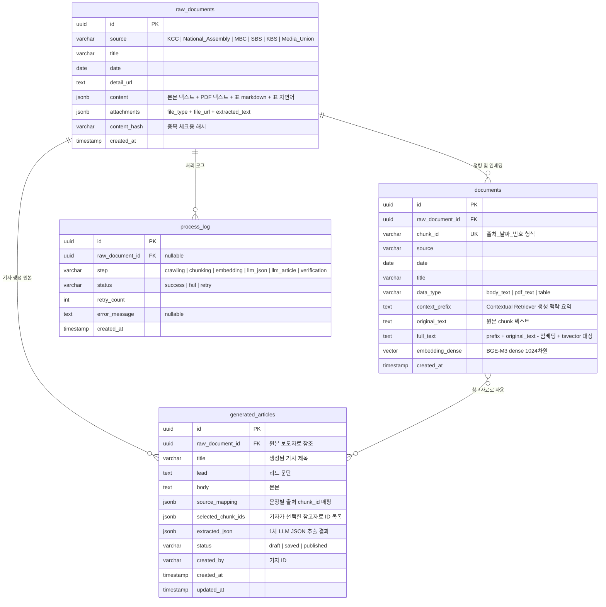

# 📰 RAG 기반 속보기사 생성 보조 시스템 - 전체 설계 문서

> 팀원 공유용 | 최종 업데이트: 2026-03-14

---

## 1. 프로젝트 한 줄 요약

공식 보도자료가 들어오면 → 과거 관련 문서를 자동으로 찾아서 → 배경 설명이 포함된 속보기사 초안을 생성하는 시스템

---

## 2. 전체 파이프라인

### 사전 작업 (주기적 실행)

```
크롤링 (APScheduler 1시간 주기)
↓
★ 에러 핸들링: retry 3회 + 실패 로그
↓
전처리 + 정제 (HTML 태그 제거, 특수문자 정리, 숫자/단위 보존)
↓
비정형 데이터 처리 (PDF: pdfplumber, HWP: olefile → 텍스트 + 표 추출)
↓
문서 청킹 (Recursive 방식, 사이즈 실험: 200 / 400 / 600자, overlap 포함)
↓
★ Contextual Retriever: 각 chunk에 문서 맥락 요약 prefix 붙이기 (LLM 호출)
↓
메타데이터 prefix 부여 ([출처 | 날짜 | 카테고리])
↓
★ BGE-M3 임베딩 (dense 1024차원 생성)
↓
★ 중복 체크: 제목+날짜 완전 일치 → 스킵, 코사인 유사도 ≥0.95 → 메타데이터 병합
↓
pgvector 저장 (embedding_dense + full_text)
```

### 실시간 (새 보도자료 입력 시)

```
기자가 보도자료 선택 (UI 왼쪽 패널)
↓
★ Hybrid 검색 (pgvector dense 검색 + PostgreSQL tsvector 키워드 검색) → RRF 합산 → 30개 후보
↓
★ 시간 가중치: RRF + time decay 합산 → 15개
↓
Re-ranking (cross-encoder) → 10개 표시 (UI 가운데 패널)
↓
기자가 참고 기사 선택 (체크박스)
↓
"AI 기사 생성" 버튼 클릭
↓
LLM 1차 호출: JSON 구조화 추출 (who, policy, decision, target, numbers, origin, effect)
↓
★ 에러 핸들링: JSON 파싱 실패 → 재요청 (최대 3회)
↓
LLM 2차 호출: Few-shot 기사 생성 (신문사 스타일 규칙 + 예시 기사 3개 + JSON)
↓
★ 에러 핸들링: 기사 형식 이상 → 재요청
↓
사실검증 (1차 JSON vs 2차 생성 기사 비교: 기관명, 수치, 날짜 일치 확인)
↓
┌─────────────────────────────────────┐
│  검증 통과 → 기사 편집기에 출력      │
│              (UI 오른쪽 패널)        │
│                                     │
│  검증 실패 → 출력 안 함             │
│              + 수동 검토 플래그      │
└─────────────────────────────────────┘
↓
기자가 편집 → 저장 / 발행 / 내보내기 (PDF, Word, HWP, TXT)
```

### 오프라인 평가 (별도 실험)

```
테스트셋 준비 (보도자료 20개 + 실제 언론사 기사 20개 정답 쌍)
↓
RAGAS 평가
├── Faithfulness (ground truth 불필요)
├── Answer Relevancy (ground truth 불필요)
├── Context Precision (ground truth 필요)
└── Context Recall (ground truth 필요)
↓
실험 1: 청킹 사이즈 최적화 (200 / 400 / 600자)
실험 2: 시간 가중치 최적화 (180 / 365 / 730일)
실험 3: 비정형 데이터 포함 효과 (본문만 / +PDF / +표)
↓
최적 파라미터 도출 → 사전 작업 파이프라인에 반영
```

---

## 3. 핵심 기술 설명

### 3-1. 임베딩 모델: BGE-M3 (BAAI)

BGE-M3는 BAAI(베이징 인공지능 아카데미)에서 만든 임베딩 모델. 이 모델로 dense vector(의미 검색용)를 생성함. 키워드 검색은 PostgreSQL tsvector를 활용하여 Hybrid 검색을 구현함.

선택 이유:

- 한국어 dense 임베딩 성능 우수
- 8192 토큰까지 처리 가능 (긴 chunk도 OK)
- 1024차원 dense vector 생성

### 3-2. Contextual Retriever

chunk가 원문에서 분리되면 맥락을 잃음. 예: "사전동의 예외 허용을 2년 연장한다고 밝혔다" → 누가? 무슨 정책? 알 수 없음.

해결: 청킹 후 각 chunk에 LLM을 호출하여 문서 전체 맥락 요약 prefix를 생성하여 부착.

```
[Before]
"사전동의 예외 허용을 2년 연장한다고 밝혔다"

[After]
"[방통위 2026-03-05 보도자료: 소상공인 점포 정보 전송 서비스 연장]
이 내용은 방통위가 소상공인 지원을 위해 발표한 정책 중 사전동의 예외 조항에 관한 것이다.
사전동의 예외 허용을 2년 연장한다고 밝혔다"
```

이 prefix가 붙은 상태로 임베딩하면 검색 정확도가 크게 향상됨.

### 3-3. Hybrid 검색 (Dense + tsvector 키워드) + RRF

두 가지 검색을 동시에 수행하고 결과를 합산하는 방식.

- Dense 검색 (pgvector): 의미 기반 유사도 → "경제 지원"으로 검색해도 "소상공인 정책"이 잡힘
- 키워드 검색 (PostgreSQL tsvector): 전문 검색 기반 매칭 → "방송통신위원회" 같은 고유명사를 정확히 잡음

같은 full_text 컬럼을 두 가지 방식으로 활용:

- BGE-M3 → dense vector 생성 → embedding_dense 컬럼에 저장
- PostgreSQL → full_text에 GIN tsvector 인덱스 → 키워드 검색

합산 방식은 RRF (Reciprocal Rank Fusion). 양쪽 검색 결과의 순위를 점수로 변환하여 합산. 가중치 튜닝이 필요 없고 구현이 단순하면서 성능이 안정적이라 선택함.

### 3-4. 시간 가중치 (Time Decay)

벡터 검색은 의미 유사도만 보고 날짜를 모름. 2022년 기사가 유사도 0.92이고 2026년 기사가 0.91이면 오래된 게 1등이 됨. 속보기사에서는 최신 정보가 더 중요하므로, 오래된 문서일수록 점수를 낮추는 시간 감쇠 가중치를 적용.

지수 감쇠 함수를 사용하며 half_life_days(반감기) 설정으로 감쇠 속도를 조절:

- 180일(6개월): 공격적 감쇠, 속보에 적합
- 365일(1년): 보통 감쇠, 일반적 추천
- 730일(2년): 완만한 감쇠, 심층 분석에 적합

최신 기사가 우선되면서도 오래된 배경 기사도 완전히 사라지지 않는 균형을 잡음.

### 3-5. Re-ranking

시간 가중치 적용 후 15개를 cross-encoder 모델로 정밀 평가하여 10개로 압축. 이 10개가 UI 가운데 패널에 표시되며, 기자가 직접 참고 기사를 선택한다.

- Hybrid 검색 (recall 중심): 관련 있을 수 있는 것을 넓게 가져옴
- Re-ranking (precision 중심): 진짜 관련 있는 것만 추림
- 기자 선택 (domain knowledge): 기자의 판단으로 최종 참고 자료 결정

cross-encoder는 query와 chunk를 동시에 입력받아 관련도를 직접 점수로 매기므로 정확도가 높지만 느림. 그래서 전체에 쓰지 않고 15개에만 적용.

한국어 특화 모델: `bongsoo/klue-cross-encoder-v1`

### 3-6. 2-Step LLM 호출

1차 호출 (JSON 추출): 기자가 선택한 참고 기사의 chunk에서 핵심 팩트를 JSON으로 정리

- who(기관), policy(정책명), decision(결정), target(대상), numbers(수치), origin(배경), effect(효과)
- 추측 금지, 없으면 null

2차 호출 (기사 생성): JSON + Few-shot 예시 기사 3개 + 스타일 규칙으로 기사 작성

- 첫 문장에 핵심 요약, 배경은 마지막 단락, 추측성 표현 금지
- JSON에 없는 내용은 절대 추가하지 않음

분리하는 이유: JSON으로 팩트를 먼저 정리하면 hallucination이 줄어들고, 사실검증도 JSON 대비로 가능해짐.

### 3-7. 사실검증

LLM 3차 호출로 1차에서 추출한 JSON과 2차에서 생성한 기사를 비교. 기관명, 수치(금액/인원/날짜), JSON에 없는 내용 추가 여부를 검증. 불일치 발견 시 기사 출력을 중단하고 수동 검토 플래그를 표시.

### 3-8. RAGAS 평가 (오프라인)

RAG 시스템의 품질을 정량적으로 측정하는 프레임워크. 실시간 파이프라인에 포함되지 않으며, 별도 오프라인 실험으로 수행한다.

- Faithfulness: 생성된 기사가 검색 문서에 기반하는 정도 (0~1) — ground truth 불필요
- Answer Relevancy: 생성된 기사가 질문에 얼마나 관련있는지 (0~1) — ground truth 불필요
- Context Precision: 검색된 문서 중 실제 관련있는 비율 (0~1) — ground truth 필요
- Context Recall: 필요한 정보를 얼마나 다 찾았는지 (0~1) — ground truth 필요

테스트셋은 보도자료 20개 + 실제 언론사 기사 20개를 정답 쌍으로 구성. 이 지표로 청킹 사이즈(200/400/600자), 시간 가중치(180/365/730일), 비정형 데이터 포함 효과를 실험하여 최적값을 도출.

---

## 4. 비정형 데이터 처리

대부분의 RAG 프로젝트는 텍스트만 다루지만, 실제 보도자료에는 PDF, HWP, 표가 포함됨. 이를 처리하면 다른 팀과의 핵심 차별점이 됨.

### 처리 대상 (현실적 범위)

- 텍스트 PDF: pdfplumber로 텍스트 + 표 추출 (보도자료 첨부파일 대부분)
- HWP: olefile 또는 pyhwp로 텍스트 추출 (정부 문서)
- 표 데이터: pdfplumber로 추출 → markdown 보존(원본용) + 자연어 문장 변환(임베딩용)
- 스캔 PDF / 이미지 OCR: 현재 범위 밖, 추후 EasyOCR로 확장 가능

### 표 데이터 처리가 중요한 이유

보도자료 본문에는 "소상공인 지원 정책"이라고만 쓰여있는데, 첨부 PDF 표에 "이용자 2만명, 예산 50억" 같은 핵심 숫자가 있는 경우가 많음. 이걸 놓치면 기사에 구체적 수치가 빠짐.

### 표 변환 방식

- Markdown 표: 원본 보존용 → raw_documents 테이블에 저장
- 자연어 문장: 임베딩용 → "2022년 이용자 수는 1만명이며 매출 기준은 10억 이하이다" 형태로 변환하여 청킹 → 임베딩

자연어로 변환해야 임베딩 모델이 의미를 제대로 파악함. "2022 1만명 10억"만 넣으면 임베딩도 의미를 모름.

### RAGAS 비정형 효과 실험

- 실험 A: 본문 텍스트만 임베딩
- 실험 B: 본문 + PDF 텍스트 포함
- 실험 C: 본문 + PDF + 표 전부 포함

C가 A보다 Context Recall이 높으면 "비정형 데이터 포함이 검색 품질을 X% 향상시켰다" 증명 가능.

---

## 5. 보완 전략

### 5-1. 에러 핸들링

파이프라인 각 단계에 retry 3회 + 상태 로그를 적용. process_log 테이블에 각 단계의 성공/실패/재시도 상태를 기록. 3회 재시도 후에도 실패하면 수동 검토 플래그를 남기고 나머지는 정상 처리 계속 진행.

### 5-2. 중복 문서 처리

같은 보도자료가 여러 소스에서 크롤링될 수 있음. 2단계로 처리:

- 1단계: 제목 + 날짜 완전 일치 → 스킵
- 2단계: 임베딩 코사인 거리 0.05 이하(유사도 95% 이상) → 텍스트 중복 저장 안 하고 메타데이터만 병합

중복이 제거되면 LLM에 넘기는 5개 slot이 다양한 정보로 채워져서 기사 품질이 올라감.

### 5-3. 시간 가중치

섹션 3-4에서 설명한 대로, RRF 점수에 시간 감쇠 가중치를 반영하여 최신 문서를 우선.

---

## 6. DB 구조

### 테이블 3개 + 후순위 1개

- **raw_documents**: 크롤링 원본 보존 (jsonb로 본문, PDF 텍스트, 표 markdown 등 전부 저장)
- **documents**: 청킹 + 임베딩된 chunk 저장 (벡터 검색 대상)
- **generated_articles**: 생성된 기사 저장 (기사 편집기에서 저장/발행한 기사)
- **process_log** (후순위): 파이프라인 단계별 성공/실패/재시도 기록

raw_document_id로 모든 테이블이 연결되어, 원본 보도자료 → chunk → 생성 기사까지 추적 가능.

---

### raw_documents 테이블 (크롤링 원본)

| 컬럼 | 타입 | 설명 |
| --- | --- | --- |
| id | UUID (PK) | 자동 생성 (gen_random_uuid) |
| doc_id | VARCHAR | 수집처 고유번호 (예: KCC_68279, NODONG_31090) |
| source | VARCHAR | KCC \| NSP \| MBC \| NODONG |
| company | VARCHAR (nullable) | 발행 기관/소속명 (예: 방통위, 언론노조 등) |
| department | VARCHAR (nullable) | 담당 부서 (주로 KCC, 없으면 null) |
| author | VARCHAR (nullable) | 작성자/기자명 (없으면 null) |
| title | VARCHAR | 보도자료 제목 |
| date | DATE | 보도자료 날짜 (YYYY-MM-DD) |
| summary | TEXT (nullable) | 기사 요약문 (없으면 null) |
| content_text | TEXT | HTML 태그 제거된 순수 본문 텍스트 |
| detail_url | TEXT | 원문 URL |
| image_urls | JSONB | 본문/썸네일 이미지 URL 배열 |
| attachments | JSONB | 첨부파일 정보 (file_name, download_url, extracted_text) |
| hashtags | JSONB | 해시태그 배열 (없으면 빈 배열) |
| references | JSONB | 외부 참고 자료 (ref_title, ref_url, extracted_text) |
| content_hash | VARCHAR | 중복 크롤링 방지용 해시값 |
| crawled_at | TIMESTAMP | 크롤링 수집 시점 |
| created_at | TIMESTAMP | DB 저장 시점 |

---

### documents 테이블 (chunk + embedding)

| 컬럼 | 타입 | 설명 |
| --- | --- | --- |
| id | UUID (PK) | 자동 생성 |
| raw_document_id | UUID (FK) | raw_documents.id 참조 → 원본 연결 |
| chunk_id | VARCHAR (UK) | 출처_날짜_번호 형식 (예: KCC_20260305_001) |
| source | VARCHAR | 출처 |
| date | DATE | 원본 문서 날짜 |
| title | VARCHAR | 원본 문서 제목 |
| data_type | VARCHAR | body_text \| pdf_text \| table |
| context_prefix | TEXT | Contextual Retriever가 생성한 맥락 요약 |
| original_text | TEXT | 원본 chunk 텍스트 |
| full_text | TEXT | prefix + original_text (이걸 임베딩함) |
| embedding_dense | VECTOR(1024) | BGE-M3 dense vector |
| created_at | TIMESTAMP | 저장 시점 |

---

### generated_articles 테이블 (생성된 기사)

| 컬럼 | 타입 | 설명 |
| --- | --- | --- |
| id | UUID (PK) | 자동 생성 |
| raw_document_id | UUID (FK) | 원본 보도자료 참조 |
| title | VARCHAR | 생성된 기사 제목 |
| lead | TEXT | 리드 문단 |
| body | TEXT | 본문 |
| source_mapping | JSONB | 문장별 출처 chunk_id 매핑 (UI 출처 아이콘용) |
| selected_chunk_ids | JSONB | 기자가 선택한 참고자료 ID 목록 |
| extracted_json | JSONB | 1차 LLM JSON 추출 결과 (사실검증 이력) |
| status | VARCHAR | draft \| saved \| published |
| created_by | VARCHAR | 기자 ID |
| created_at | TIMESTAMP | 생성 시점 |
| updated_at | TIMESTAMP | 최종 수정 시점 |

---

### process_log 테이블 (후순위)

| 컬럼 | 타입 | 설명 |
| --- | --- | --- |
| id | UUID (PK) | 자동 생성 |
| raw_document_id | UUID (FK, nullable) | 관련 문서 참조 |
| step | VARCHAR | crawling \| chunking \| embedding \| llm_json \| llm_article \| verification |
| status | VARCHAR | success \| fail \| retry |
| retry_count | INT | 재시도 횟수 (최대 3) |
| error_message | TEXT (nullable) | 에러 메시지 |
| created_at | TIMESTAMP | 기록 시점 |

---

### 테이블 관계

```
raw_documents (1) ──→ (N) documents        : 하나의 보도자료에서 여러 chunk 생성
raw_documents (1) ──→ (N) generated_articles : 하나의 보도자료로 여러 기사 생성 가능
raw_documents (1) ──→ (N) process_log       : 처리 단계별 로그
documents     (N) ←──→ (N) generated_articles : 기자가 선택한 chunk들이 기사에 참조됨
```

### 핵심 인덱스

- documents.embedding_dense → pgvector IVFFlat 인덱스 (dense 벡터 검색용)
- documents.full_text → GIN tsvector 인덱스 (키워드 검색용, Hybrid 검색의 sparse 역할)
- documents.source, documents.date → 일반 인덱스 (필터링용)
- raw_documents.content_hash → 유니크 인덱스 (중복 방지용)
- generated_articles.status → 인덱스 (발행 상태 필터링용)

### generated_articles를 추가한 이유

UI에서 기자가 "저장" 또는 "발행" 버튼을 누르면 생성된 기사를 저장할 곳이 필요하다. source_mapping 컬럼에 문장별 출처 chunk_id를 매핑해두면 UI의 출처 표시 기능이 작동하고, extracted_json에 1차 LLM 결과를 저장해두면 사실검증 이력으로 활용 가능하다.

---

## 7. 기술 스택

| 분야 | 기술 | 비고 |
| --- | --- | --- |
| 언어 | Python | |
| 크롤링 | requests + BeautifulSoup | |
| 비정형 처리 | pdfplumber, olefile/pyhwp | PDF, HWP 텍스트 + 표 추출 |
| 스케줄링 | APScheduler | 1시간 주기 자동 크롤링 |
| DB | PostgreSQL + pgvector | 원문 jsonb + 벡터 저장 통합 |
| 임베딩 | BGE-M3 (BAAI) | dense 1024차원 생성 |
| 검색 | Hybrid (dense + tsvector) + RRF + 시간 가중치 | pgvector + PostgreSQL GIN |
| Re-ranking | cross-encoder | bongsoo/klue-cross-encoder-v1 |
| LLM | OpenAI API (4o-mini) | JSON 추출 + 기사 생성 + 사실검증 |
| 평가 | RAGAS | 정량적 RAG 품질 측정 |
| 배포 | AWS EC2/ECS | 추후 Bedrock/Ollama 전환 가능 |

---

## 8. 역할 분담 (4명)

| 역할 | 담당 범위 |
| --- | --- |
| 크롤링 담당 | 크롤러 개발(APScheduler), 데이터 수집, 비정형 텍스트 추출(PDF/HWP/표), JSON 형태로 전처리 담당에게 전달 |
| 전처리 담당 | 텍스트 정제, 청킹 모듈(Recursive, 사이즈 파라미터화), 메타데이터 태깅, chunk 리스트를 RAG 담당에게 전달 |
| RAG 담당 | Contextual Retriever prefix 생성, 메타데이터 prefix 부여, BGE-M3 임베딩, Hybrid 검색 + RRF + 시간 가중치, Re-ranking, LLM 프롬프트 설계(JSON 추출 + 기사 생성 + 사실검증), RAGAS 평가, 청킹 사이즈 실험 |
| 백+프론트 담당 | pgvector 스키마 설계, 인덱스 세팅, 저장/검색 API, 에러 핸들링 인프라(process_log), 데모 UI |

### 담당 간 데이터 흐름

```
크롤링 → JSON 원본 데이터 → 전처리
전처리 → chunk 리스트 {chunk_id, original_text, source, date, title} → RAG
RAG → 임베딩 벡터 + prefix 붙은 chunk → 백+프론트 (저장 API)
백+프론트 → 검색 API → RAG (검색 호출)
```

### 협업 포인트

| 누구 + 누구 | 맞춰야 할 것 |
| --- | --- |
| 크롤링 ↔ 전처리 | 크롤링 결과 JSON 포맷 합의 (source, title, date, content, attachments) |
| 전처리 ↔ RAG | chunk 데이터 형식 합의, 청킹 사이즈 실험 시 전처리가 생성 + RAG가 평가 |
| RAG ↔ 백+프론트 | pgvector 벡터 차원수(1024), 저장/검색 API 입출력 형식 |

---

## 9. 개발 순서

```
Phase 1: 크롤러 개발 + DB 스키마 구축
Phase 2: 전처리 + 청킹 모듈
Phase 3: Contextual Retriever + BGE-M3 임베딩 + pgvector 저장
Phase 4: Hybrid 검색 + 시간 가중치 + Re-ranking
Phase 5: LLM JSON 추출 + 기사 생성 + 사실검증
Phase 6: 에러 핸들링 + 중복 처리
Phase 7: RAGAS 평가 + 청킹 사이즈/시간 가중치 실험
Phase 8: 데모 UI + 최종 통합
```

---

## 10. 실험 설계

### 실험 1: 청킹 사이즈 최적화

| 변수 | 값 |
| --- | --- |
| 실험 변수 | 청킹 사이즈 (200 / 400 / 600자) |
| Overlap | 각 사이즈의 25% |
| 고정 변수 | BGE-M3, Hybrid 검색, Re-ranking top-5 |
| 평가 지표 | faithfulness, context_precision, context_recall, answer_relevancy |
| 테스트셋 | 보도자료 20개 + 실제 언론사 기사 20개 (정답 쌍) |

### 실험 2: 시간 가중치 최적화

| 변수 | 값 |
| --- | --- |
| 실험 변수 | half_life_days (180 / 365 / 730) |
| 고정 변수 | 청킹 최적값, BGE-M3, Re-ranking top-5 |
| 평가 지표 | context_precision, context_recall |

### 실험 3: 비정형 데이터 포함 효과

| 변수 | 값 |
| --- | --- |
| 실험 A | 본문 텍스트만 |
| 실험 B | 본문 + PDF 텍스트 |
| 실험 C | 본문 + PDF + 표 전부 |
| 평가 지표 | context_recall, faithfulness |

---

## 11. 캡스톤 어필 포인트

1. **BGE-M3 Hybrid 검색**: dense + PostgreSQL tsvector 키워드 검색 통합
2. **Contextual Retriever**: chunk 문맥 보존으로 검색 정확도 향상
3. **시간 가중치**: 속보 특성에 맞는 최신 정보 우선 검색
4. **Re-ranking**: 2단계 검색으로 precision 극대화
5. **비정형 데이터 처리**: PDF, HWP, 표까지 파이프라인에 통합 (다른 팀과 차별점)
6. **RAGAS 정량 평가**: 3가지 실험(청킹/시간가중치/비정형)으로 최적값 도출
7. **2-Step LLM + 사실검증**: JSON 분리로 hallucination 최소화
8. **에러 핸들링 + 중복 처리**: 프로덕션 레벨의 안정성 설계
9. **확장 가능성**: 추후 LoRA 파인튜닝으로 신문사별 스타일 정밀 반영, Bedrock/Ollama 전환 가능

---

## 12. Mermaid 다이어그램

### 시스템 아키텍처

```mermaid
graph TB
    %% ===== 스타일 정의 =====
    classDef crawl fill:#4A90D9,stroke:#2E6BA6,color:#fff,stroke-width:2px
    classDef preprocess fill:#7B68EE,stroke:#5B48CE,color:#fff,stroke-width:2px
    classDef embed fill:#E67E22,stroke:#C0651B,color:#fff,stroke-width:2px
    classDef db fill:#2ECC71,stroke:#1FA85A,color:#fff,stroke-width:2px
    classDef search fill:#E74C3C,stroke:#C0392B,color:#fff,stroke-width:2px
    classDef llm fill:#F39C12,stroke:#D4850F,color:#fff,stroke-width:2px
    classDef output fill:#1ABC9C,stroke:#16A085,color:#fff,stroke-width:2px
    classDef eval fill:#FF6B9D,stroke:#D4507A,color:#fff,stroke-width:2px
    classDef scheduler fill:#8E44AD,stroke:#6C3483,color:#fff,stroke-width:2px
    classDef user fill:#3498DB,stroke:#2176AE,color:#fff,stroke-width:2px

    %% ===== 외부 데이터 소스 =====
    subgraph SOURCES["📡 외부 데이터 소스"]
        S1["방통위 보도자료\n(KCC)"]
        S2["국회 동향\n(NSP)"]
        S3["방송사 보도자료\n(MBC / SBS / KBS)"]
        S4["언론노조 성명"]
    end

    %% ===== 사전 작업 파이프라인 =====
    subgraph BATCH["⚙️ 사전 작업 파이프라인 (1시간 주기)"]
        direction TB
        SCH["APScheduler\n1시간 주기 실행"]:::scheduler

        subgraph CRAWL["크롤링 모듈"]
            C1["requests +\nBeautifulSoup"]:::crawl
            C2["비정형 처리\npdfplumber / olefile"]:::crawl
        end

        subgraph PREP["전처리 모듈"]
            P1["텍스트 정제\nHTML 태그·특수문자 제거"]:::preprocess
            P2["표 데이터 변환\nMarkdown + 자연어"]:::preprocess
            P3["Recursive 청킹\n200/400/600자 실험"]:::preprocess
            P4["메타데이터 태깅\n출처·날짜·카테고리"]:::preprocess
        end

        subgraph ENRICH["임베딩 & 보강 모듈"]
            CR["Contextual Retriever\n문서 맥락 prefix 생성\n(LLM 호출)"]:::embed
            E1["BGE-M3 임베딩\ndense 1024차원"]:::embed
            DUP["중복 체크\n제목+날짜 일치 → 스킵\n코사인 ≥0.95 → 병합"]:::embed
        end
    end

    %% ===== 데이터베이스 =====
    subgraph DATABASE["🗄️ PostgreSQL + pgvector"]
        RAW[("raw_documents\n원본 jsonb 저장")]:::db
        DOC[("documents\nembedding_dense\n+ full_text (tsvector)")]:::db
        ART[("generated_articles\n생성 기사 저장")]:::db
        LOG[("process_log\n단계별 상태 기록")]:::db
    end

    %% ===== 실시간 처리 파이프라인 =====
    subgraph REALTIME["🔴 실시간 처리 파이프라인"]
        direction TB
        INPUT["📄 기자가 보도자료 선택\n(UI 왼쪽 패널)"]:::user

        subgraph RETRIEVAL["Hybrid 검색 모듈"]
            HYB_D["Dense 검색\npgvector 코사인 유사도"]:::search
            HYB_K["키워드 검색\nPostgreSQL tsvector"]:::search
            RRF["RRF 합산 → 30개"]:::search
            TW["시간 가중치 적용\ntime decay → 15개"]:::search
            RR["Re-ranking\nklue-cross-encoder\n→ 10개"]:::search
        end

        SELECT["기자가 참고 기사 선택\n(UI 가운데 패널 체크박스)"]:::user
        GEN_BTN["AI 기사 생성 버튼 클릭"]:::user

        subgraph LLM_PIPELINE["LLM 파이프라인 (OpenAI 4o-mini)"]
            L1["1차 LLM: JSON 추출\nwho·policy·decision\ntarget·numbers·origin·effect"]:::llm
            L2["2차 LLM: 기사 생성\nFew-shot 예시 3개\n+ 스타일 규칙"]:::llm
            L3["3차 LLM: 사실검증\nJSON vs 기사 비교\n기관명·수치·날짜"]:::llm
        end

        OUT["📰 기사 편집기에 출력\n(UI 오른쪽 패널)\n저장 / 발행 / 내보내기"]:::output
        FLAG["🚩 수동 검토 플래그"]:::output
    end

    %% ===== 오프라인 평가 모듈 (별도) =====
    subgraph EVAL["🧪 오프라인 평가 모듈 (RAGAS)"]
        direction TB
        TS["테스트셋\n보도자료 20개\n+ 실제 언론사 기사 20개"]:::eval

        subgraph EXPERIMENTS["실험 설계"]
            EX1["실험 1: 청킹 사이즈\n200 / 400 / 600자"]:::eval
            EX2["실험 2: 시간 가중치\n180 / 365 / 730일"]:::eval
            EX3["실험 3: 비정형 데이터\n본문만 / +PDF / +표"]:::eval
        end

        subgraph METRICS["평가 지표"]
            M1["Faithfulness\n(ground truth 불필요)"]:::eval
            M2["Answer Relevancy\n(ground truth 불필요)"]:::eval
            M3["Context Precision\n(ground truth 필요)"]:::eval
            M4["Context Recall\n(ground truth 필요)"]:::eval
        end

        RESULT["📊 최적 파라미터 도출\n→ 사전 작업 파이프라인에 반영"]:::eval
    end

    %% ===== 연결: 사전 작업 =====
    SOURCES --> SCH
    SCH --> C1
    C1 --> C2
    C2 --> P1
    P1 --> P2
    P2 --> P3
    P3 --> P4
    P4 --> CR
    CR --> E1
    E1 --> DUP
    DUP --> DOC
    C2 --> RAW

    %% ===== 연결: 실시간 처리 =====
    INPUT --> HYB_D
    INPUT --> HYB_K
    DOC --> HYB_D
    DOC --> HYB_K
    HYB_D --> RRF
    HYB_K --> RRF
    RRF --> TW
    TW --> RR
    RR --> SELECT
    SELECT --> GEN_BTN
    GEN_BTN --> L1
    L1 --> L2
    L2 --> L3
    L3 -->|"검증 통과"| OUT
    L3 -->|"검증 실패"| FLAG
    OUT --> ART
    RAW -.->|"원본 참조\n(사실검증)"| L3

    %% ===== 연결: 오프라인 평가 =====
    TS --> EXPERIMENTS
    EX1 --> METRICS
    EX2 --> METRICS
    EX3 --> METRICS
    METRICS --> RESULT
    RESULT -.->|"최적값 반영\n(청킹·가중치·데이터 범위)"| BATCH
    DOC -.->|"검색 대상"| EVAL
    REALTIME -.->|"생성 결과 샘플"| EVAL

    %% ===== 에러 핸들링 연결 =====
    C1 -.->|"실패 로그"| LOG
    L1 -.->|"파싱 실패 → 재시도 3회"| LOG
    L2 -.->|"형식 이상 → 재시도"| LOG
    L3 -.->|"검증 실패 기록"| LOG
```



### ERD (Entity Relationship Diagram)


