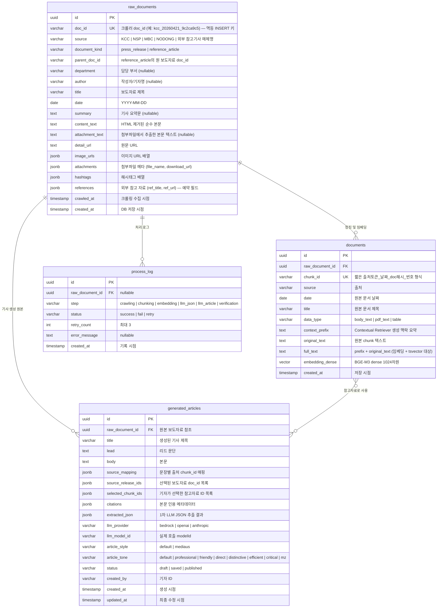

# ERD (Entity Relationship Diagram)

```mermaid
erDiagram
  raw_documents {
    uuid id PK
    varchar doc_id UK "크롤러 doc_id (예: kcc_20260421_9c2ca9c5) — 멱등 INSERT 키"
    varchar source "KCC | NSP | MBC | NODONG | 외부 참고기사 매체명"
    varchar document_kind "press_release | reference_article"
    varchar parent_doc_id "reference_article의 원 보도자료 doc_id"
    varchar department "담당 부서 (nullable)"
    varchar author "작성자/기자명 (nullable)"
    varchar title "보도자료 제목"
    date date "YYYY-MM-DD"
    text summary "기사 요약문 (nullable)"
    text content_text "HTML 제거된 순수 본문"
    text attachment_text "첨부파일에서 추출한 본문 텍스트 (nullable)"
    text detail_url "원문 URL"
    jsonb image_urls "이미지 URL 배열"
    jsonb attachments "첨부파일 메타 (file_name, download_url)"
    jsonb hashtags "해시태그 배열"
    jsonb references "외부 참고 자료 (ref_title, ref_url) — 예약 필드"
    timestamp crawled_at "크롤링 수집 시점"
    timestamp created_at "DB 저장 시점"
  }

  documents {
    uuid id PK
    uuid raw_document_id FK
    varchar chunk_id UK "짧은 출처토큰_날짜_doc해시_번호 형식"
    varchar source "출처"
    date date "원본 문서 날짜"
    varchar title "원본 문서 제목"
    varchar data_type "body_text | pdf_text | table"
    text context_prefix "Contextual Retriever 생성 맥락 요약"
    text original_text "원본 chunk 텍스트"
    text full_text "prefix + original_text (임베딩 + tsvector 대상)"
    vector embedding_dense "BGE-M3 dense 1024차원"
    timestamp created_at "저장 시점"
  }

  generated_articles {
    uuid id PK
    uuid raw_document_id FK "원본 보도자료 참조"
    varchar title "생성된 기사 제목"
    text lead "리드 문단"
    text body "본문"
    jsonb source_mapping "문장별 출처 chunk_id 매핑"
    jsonb source_release_ids "선택된 보도자료 doc_id 목록"
    jsonb selected_chunk_ids "기자가 선택한 참고자료 ID 목록"
    jsonb citations "본문 인용 메타데이터"
    jsonb extracted_json "1차 LLM JSON 추출 결과"
    varchar llm_provider "bedrock | openai | anthropic"
    varchar llm_model_id "실제 호출 modelId"
    varchar article_style "default | mediaus"
    varchar article_tone "default | professional | friendly | direct | distinctive | efficient | critical | mz"
    varchar status "draft | saved | published"
    varchar created_by "기자 ID"
    timestamp created_at "생성 시점"
    timestamp updated_at "최종 수정 시점"
  }

  process_log {
    uuid id PK
    uuid raw_document_id FK "nullable"
    varchar step "crawling | chunking | embedding | llm_json | llm_article | verification"
    varchar status "success | fail | retry"
    int retry_count "최대 3"
    text error_message "nullable"
    timestamp created_at "기록 시점"
  }

  raw_documents ||--o{ documents : "청킹 및 임베딩"
  raw_documents ||--o{ generated_articles : "기사 생성 원본"
  raw_documents ||--o{ process_log : "처리 로그"
  documents }o--o{ generated_articles : "참고자료로 사용"
```
